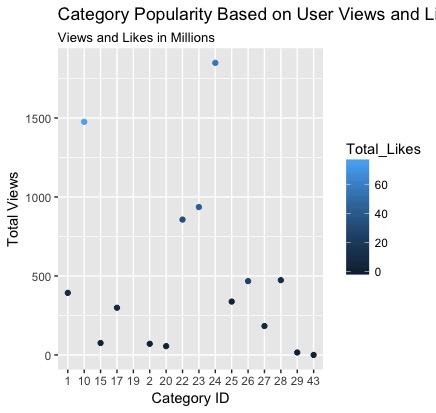
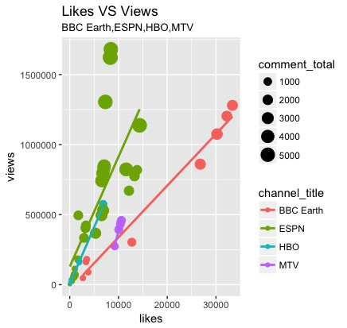
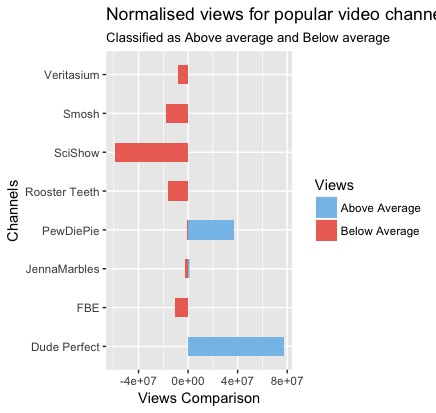
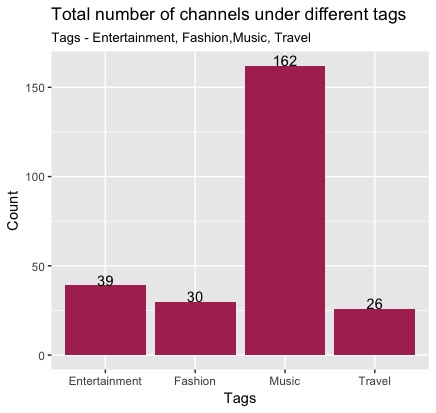
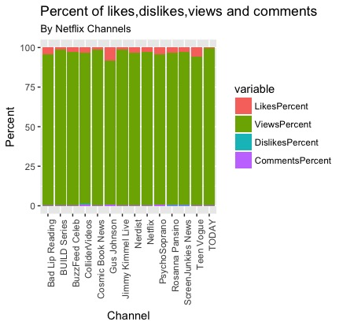

**You Tube Video Analysis** 
by Akansha Singh | aks.singh26@gmail.com asingh07@syr.edu
### Dataset from website www.kaggle.com
####Snapshots
- Image1 : Category Popularity Based on User Views and Likes
- Image2 : 4D view between Channels and their likes, views and comments, and best fit lines
- Image3 : Categorization as "Above Average and Below Average" of each video view of popular channels
- Image4 : Total number of channels in different tags
- Image5 : Percentage of Like, Views, Dislikes and Comments of Netflix videos channels

